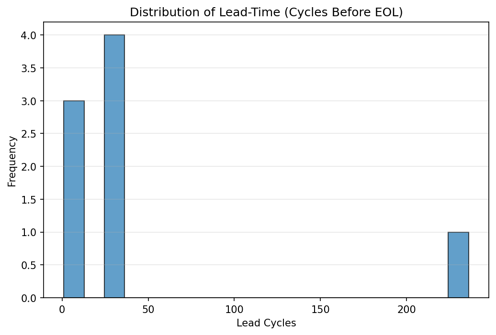

# Battery Anomaly Detection

I built a phase-aware anomaly detector on NASA’s Li-ion cycling data. It tells me how many cycles of warning I have before End-of-Life (EoL = 80% of baseline capacity). It’s not a black box. Each flag is tied to real battery physics, capacity fade and rising internal resistance. The plots show the capacity curve, the 0.8× baseline EoL line, and exactly where the first anomaly pops up.

# What it does:

- **Spots weird cycles in two ways:** simple physics rules (sudden capacity dips or resistance spikes) plus a per-battery IsolationForest (unsupervised ML) trained on that cell’s healthy early life.

- **Reports lead-time:** the gap (in cycles) between the first solid anomaly and EoL, that’s the number you can plan maintenance around.

- **Stays explainable:** everything is drawn on the chart so you can see what happened and when.

**Why do we care?** In EVs, grid storage, or aerospace, 30–200+ cycles of early warning can be the difference between a scheduled pack swap and an expensive (or dangerous) failure.

# The Physics

### What actually ages a Li-ion cell?

- **Loss of Lithium Inventory (LLI):** Electrolyte reduction forms the SEI (solid–electrolyte interphase) on the anode. SEI growth is partly irreversible and consumes active Li⁺, so there’s less lithium left to shuttle, which directly lowers usable capacity.

- **Loss of Active Material (LAM):** Particles can micro-crack (especially under high depth-of-discharge or high C-rates). Cracks isolate material from the conductive network → less active area, higher impedance, and faster fade.

- **Impedance growth:** Transport gets harder with age. In simple terms we split it into:

      - Re (ohmic): leads, current collectors, separator/electrolyte bulk. Aging, corrosion or dry-out inches Re ↑.

      - Rct (charge-transfer): interfacial kinetics at the electrode|electrolyte boundary. SEI thickening or surface degradation pushes Rct ↑.

  (There are other elements like diffusion/Warburg impedance, but in this dataset Re and Rct are the accessible proxies.)

- Temperature effects: High T accelerates side reactions (roughly Arrhenius-like), so LLI/LAM and impedance growth speed up. Very low T can promote Li plating during charge, which shows up later as sudden capacity loss and impedance spikes.

### How it shows up in the data:

- Capacity (Ah) slowly drops as the cell ages (LLI/LAM). If it suddenly steps down or the slope gets steeper, that’s a red flag.

- Re and Rct usually creep up as interfaces thicken or contacts degrade; sharp spikes are classic anomalies.

- Ambient temperature is context: clusters of anomalies at higher temps make scientific sense.

### Why I use 80% of baseline as EoL:

80% of the starting capacity is a practical cutoff: below that, voltage sag and heat get annoying in real use. I don’t compare to cycle 1. Instead, I build a step-up-safe baseline: rolling median over the first half of life (skip the first 3 cycles), then take the 95th percentile. That way, small early “conditioning” gains don’t skew the threshold.

## How it's used in this project:

- I compute Δ per cycle (dcap, dRe, dRct) and robust z-scores (median+MAD, rolling window) to measure how unusual each step is.

- I also track a short capacity slope to catch “kinks” where fade accelerates.

- My consensus detector is phase-aware: early life = strict (Rules AND IsolationForest), late life = permissive (Rules OR IsolationForest).

- I mark EoL when the rolling median(5) capacity stays below 0.8×baseline for 5 cycles.

- Lead-time = EoL cycle − first trustworthy anomaly. That’s the number you can actually plan around.

# Dataset Used:

I used the open-source [**NASA Li-ion aging dataset**](https://www.kaggle.com/datasets/mystifoe77/nasa-battery-data-cleaned) because it provides real cycling data under controlled protocols, all the way to end of life. That gives anomalies a physical context instead of synthetic noise. Columns like capacity, Re, Rct, and ambient temperature let the detector connect flags to mechanisms such as capacity fade and rising resistance. The data spans many cells and long sequences, which makes training repeatable and the results easy to audit.

# How to run it:

1. Open the project

Download or clone this repo. You should see `Battery_Anomaly_Detection.ipynb`, `Battery_Data_Cleaned.csv`, `run.py`, the `scripts/` and `tests/` folders, and an `outputs/` folder (created on first run). The files `anomaly_summary.csv` and `report.html` are generated when you run the project.

2. Use Python 3.8+ and install the basics by opening up terminal and paste the following:

`pip install -U pandas numpy matplotlib scikit-learn jupyter ipykernel nbconvert nbformat` and optionally, `pip install -U pytest`

Or, go into terminal, and open this project folder by typing:

`cd desktop/battery-anomaly-detector` (assuming you extracted the folder on desktop)

Then, just type:

`pip install -r requirements.txt` and it'll install all the dependencies on its own

3. Run the project:

While inside the project folder on your terminal (using the `cd` command), type:

`python run.py`

This executes the notebook in place and writes:

- `anomaly_summary.csv`
- plots in `outputs/`
- `report.html`

Option B: Notebook (no terminal)

Open `Battery_Anomaly_Detection.ipynb` in Jupyter or VS Code and “Run All”.

4. After you’ve generated `anomaly_summary.csv`, run:

`python scripts/eval_leadtime.py`

This writes to `outputs/`:

- `lead_time_histogram.png`
- `lead_time_top5.csv`
- `lead_time_metrics.json`

For macOS/Linux, use `python3` instead of `python`

## Results at a Glance

- Cells analyzed: **34**
- EoL detected: **12**
- First anomaly detected: **33**
- Lead-time available: **8** cells (median **33** cycles).  
  See [Lead-Time Analysis](#lead-time-analysis) for the histogram and Top-5 table.

# Results (with explanations)

This section shows what the detector found on real cells, with capacity curves, anomaly markers, and the 0.8x baseline EoL line. Figures are pulled from `outputs/` and each one is explained in plain language, while the complete numbers can be found in `anomaly_summary.csv`.

### Battery 6 — very early warning (best case)

**What you’re seeing:**

- The blue capacity curve glides downward over hundreds of cycles. Crosses/markers indicate cycles the consensus detector called anomalous. The dashed horizontal line is the EoL threshold (0.8×baseline).

- First anomaly at cycle 144; EoL at cycle 380 → 236 cycles of lead-time.

**Interpretation:**

The detector caught a structural change in the cell’s behavior well before capacity sank to 80%. That sort of long runway is gold for maintenance planning.

### Battery 42 — sudden pattern break well before EoL

**What you’re seeing:**

- A mostly smooth fade, then a noticeable kink/sag shows up, with anomalies clustering before EoL.

- First anomaly at cycle 72; EoL at cycle 108 → 36 cycles of lead-time.

**Interpretation:**

A clear change shows up. Capacity starts falling faster and internal resistance rises at the same time, meaning the cell leaves its normal trend well before it reaches 80%.

### Battery 44 — unstable cycling (jitter instead of smooth fade)

**What you’re seeing:**

- Instead of a monotonic decline, capacity oscillates within a tightening envelope, and the detector peppers that region with anomaly markers.

- First anomaly at cycle 72; EoL at cycle 108 → 36 cycles of lead-time.

**Interpretation:**

The capacity does not decline smoothly but wobbles from cycle to cycle, which points to unstable interfaces or small build differences, so the detector flags many short, repeat issues before EoL.

## Lead-Time Analysis

**What is it?** Lead-time = cycles between the **first detected anomaly** and **EoL**. Positive values mean we flagged issues **before** EoL.

**Why it matters:** It turns anomaly scores into an actionable **warning window** (maintenance / derating / replacement).

**Largest Lead-Times (Top 5)**

| battery_id | lead_cycles | first_anomaly_test_id | eol_test_id | total_cycles |
| ---------: | ----------: | --------------------: | ----------: | -----------: |
|          6 |         236 |                   144 |         380 |          556 |
|         42 |          36 |                    72 |         108 |          275 |
|         44 |          36 |                    72 |         108 |          275 |
|         45 |          36 |                    50 |          86 |          184 |
|         43 |          30 |                    78 |         108 |          275 |

_Note:_ We count lead-time only when `first_anomaly_test_id < eol_test_id`. Cells with anomaly ≥ EoL aren’t included in the lead-time stats.

## Anomaly Summary

After running the project, `anomaly_summary.csv` is created, which is a quick map of what the detector found for each cell. `Battery_id` is the cell ID. `Baseline (Ah)` is the early-life reference capacity. `EoL Threshold (Ah)` is 80% of that baseline. `First Anomaly (cycle)` is the first cycle that passes the consensus rules. `EoL (cycle)` is when the rolling median capacity stays under the threshold for 5 cycles. `Lead (cycles)` is the gap between those two points, so higher means more warning. `# Anomalies` counts how many cycles were flagged after applying hysteresis. `Total Cycles` is how long the test ran.

In the figures above, Battery 6 shows the best case with 236 cycles of warning (`first anomaly at 144, EoL at 380`). Batteries 42 and 44 each have 36 cycles of warning (`first anomaly at 72, EoL at 108`). Battery 44 also has a higher anomaly count, which matches its jittery pattern in the plot. This table lets you rank cells by how early the detector reacts and decide where maintenance attention should go first.

# Limitations and Assumptions

- This project uses capacity and resistance summaries per cycle. If full voltage–time curves were available, adding dQ/dV or curve-shape features could improve sensitivity to subtle mechanisms.

- Ambient temperature is used as context, not fully normalized. Extreme environments can change thresholds.

- EoL follows the common 80% of baseline convention with 5-cycle persistence. Programs that define EoL differently will need to adjust the rule.

- IsolationForest contamination is set to a conservative default. Very noisy fleets may need a small tune.

# FAQs

### How is EoL defined?

When the rolling median over 5 cycles of capacity stays below 0.8×baseline for 5 consecutive cycles. Baseline is computed from early-life data in a way that ignores small step-ups.

### Why use both rules and IsolationForest?

The rules encode battery science. The model catches odd combinations the rules miss. Together they reduce false alarms and improve coverage.

### Why judge a battery against itself?

Cells can be healthy yet different. Per-cell scaling and training avoid punishing normal variation across units.
